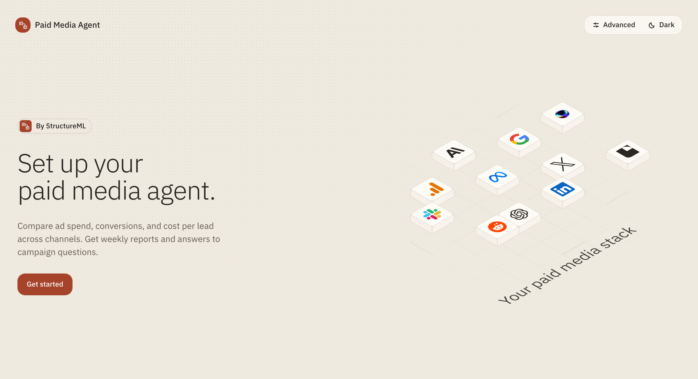

<div align="center">
  <p>
    <a href="https://structureml.com/">
      
    </a>
  </p>
  <h1>Paid Media Agent</h1>
  <p>by <a href="https://structureml.com/">StructureML</a></p>
  <p>Cross-channel campaign analysis and reporting.<br>Runs locally or in Docker, with the model you choose.</p>
  <p>
    <a href="#quick-start">Quick start</a> ·
    <a href="#running-it">Running it</a> ·
    <a href="OPERATIONS.md">Documentation</a> ·
    <a href="CONTRIBUTING.md">Contributing</a>
  </p>
</div>

<a href="docs/screenshots/setup-preview-light.png">
  
</a>

<p align="center">
  <sub><a href="docs/screenshots/setup-preview.png">Setup console, dark</a> · <a href="docs/screenshots/report-preview.png">Example report</a> · <a href="docs/screenshots/demo-page.png">Demo page</a> · <a href="docs/media/demo-replay.mp4">Demo replay (video)</a>, all from synthetic accounts.</sub>
</p>

Paid Media Agent helps you understand what changed across your ad accounts and decide what to do
next. Ask questions in Slack or the terminal, generate performance reports, and prepare campaign
changes for review.

It comes with ad platform integrations, analysis and reporting skills, and a paid-media wiki.
Connect your accounts, add your company context, and run it on your machine or your own server.
You choose the model.

[StructureML](https://structureml.com/) researches foundational machine learning for structured
data. We are extending this agent with models for media-buying decisions and with first-party
data such as Google Analytics and CRM pipeline, so spend can be judged against the revenue it
produces.

## What it does

- **Compare campaign performance.** Track spend, conversions, cost per lead, and budget pacing
  across connected accounts.
- **Investigate changes.** Find the campaigns behind a shift, check the supporting data, and flag
  gaps that could change the conclusion.
- **Produce reports.** Generate weekly or monthly summaries with charts, campaign tables, and
  recommendations. Download HTML, or PDF when the host has the rendering libraries installed.
- **Explain, forecast, and recommend.** Split a change in CPA, ROAS, or conversions into its
  drivers, forecast what a budget change would do with an 80% range, and recommend how to split
  an account's budget across its campaigns.
- **Prepare changes for review.** Propose campaign updates with a reason and a plan for checking
  the result.

The model decides what to investigate. Code calculates the metrics and checks report figures
against the source data. Large responses stay in files; the model receives summaries with the
source, date window, and data-quality flags.

## How it keeps answers honest

- **Code does the arithmetic.** Tools return totals, changes marked better or worse, rankings,
  the dates a window resolved to, and account-to-account comparisons. Anything else comes from a
  `calculate` tool, never from arithmetic in the reply.
- **Every answer is checked.** Each figure in a final answer must trace to a tool result, the
  account goals, or the user's own words. An answer that fails is sent back once; anything still
  unsourced is marked unverified.
- **Every change waits for a person.** A proposal shows a summary written from its record, waits
  for an authorized approval, runs once, and is read back to confirm it applied.
- **It knows what it did not see.** Failed reads, days without data, conversions still arriving,
  and differences in attribution are stated, not shown as zero.

**Measured.** A [30-question eval](docs/architecture/evals.md) on synthetic accounts grades each
answer with deterministic checks and a judge model. On the current code Claude Sonnet 5.5 passed
28 of 30:

| | Result |
| --- | --- |
| Questions passed | 28 of 30 (93%) |
| Judge scores, out of 5 | correct 4.5, grounded 4.2, complete 4.2, clear 4.3 |
| Cost per answer | $0.046, with 90% of input read from the prompt cache |
| Model calls per answer | 3.6; median 15 seconds |

The first baseline, on Claude Haiku 4.5 before the answer-quality work, was 12 of 30. The eval log
records every run and what each one found.

**Status.** Tested end to end on synthetic accounts: the offline demo, the eval, and the Docker
image. The live Pipeboard read path, live ad-account writes, and the Slack app have not yet been
run against real accounts or a real workspace.

**Live ad account changes are off by default.** Enabling them requires a configured write policy,
[release checks](docs/operations/live-write-runbook.md), and approval from an authorized reviewer.
Approval applies to the exact proposal reviewed; editing it requires a new approval.

## Quick start

Requires **Python 3.11+** and [uv](https://docs.astral.sh/uv/).

```bash
git clone https://github.com/billlyzhaoyh/paid-media-agent.git
cd paid-media-agent
uv sync
uv run paid-media-agent setup
```

The setup command opens a local console for choosing a model, connecting ad accounts, and
running the agent. No frontend build is needed. The CLI exposes the same connection actions with JSON
output if you prefer the terminal.

You can also ask your coding agent to guide setup:

> Read AGENTS.md and .agents/skills/paid-media-onboarding/SKILL.md. Help me connect a model,
> connect my ad accounts, add my business context, and run it locally.

**Try it without model keys or ad accounts:**

```bash
uv run paid-media-agent demo --visual
```

The demo opens an [animated page](docs/screenshots/demo-page.png) for Northwind, a simulated
store ([video of the replay](docs/media/demo-replay.mp4)). A simulation is used because it knows
what real data cannot: which anomalies were planted and what each campaign's true spend curve
is. The page is mostly diagrams:

- **Two jobs, two ideas.** Spotting an unusual day: a fixed ±50% rule against a range
  [TabPFN](https://priorlabs.ai/) learns for each campaign at its budget. Moving budget: from
  where the response curve is flat to where it is steep, until the slopes meet.
- **Feature engineering.** For each job, the raw daily row, the engineered row TabPFN is given,
  and what comes back, with the measured effect of the feature choices.
- **Eight weeks, replayed.** Day by day: the agent's weekly budget moves, the conversions they
  gain over budgets left alone, and its weekly check for unusual days.
- **The result.** Over the eight weeks TabPFN raised 8 alerts: 6 of the 10 planted problems and
  2 false alarms. A ±50% day-over-day rule caught 9 and raised 74 false alarms. The agent's
  budget moves produced 39.6 conversions a day against 37.3 with budgets left alone (+6.1% at
  the same total budget); the best possible split would have produced 40.0.
- **The report the agent wrote** for the last fortnight is linked from the page
  ([screenshot](docs/screenshots/demo-report.png)).

The demo calls no model and no TabPFN: it replays a recording of the weekly decisions, TabPFN's
answers, and the agent's text, and the page says so. It doesn't touch live campaigns.
`demo --with-proposal` prints the analysis and approval flow as text.

Once configured, ask a question or generate a report:

```bash
uv run paid-media-agent ask "Which campaigns had the largest increase in cost per lead last week?"
uv run paid-media-agent report --cadence weekly
```

Questions use your configured model. The `report` command runs without one, using supported
campaign-performance adapters.

Every read is also kept as history: daily snapshots, campaign budgets and status, and a log of
changes. It shows how late conversions arrive, what each budget was, and who changed it. Anomaly
checks judge recent days against the range the history predicts, locally or, if you opt in, with
[TabPFN](OPERATIONS.md#anomaly-checks). Build it
with `sync`, look at it with `history`, or try it on simulated campaigns first:

```bash
uv run paid-media-agent simulate --days 180
uv run paid-media-agent history --scenario baseline --view daily
uv run paid-media-agent sync
```

A budget bandit recommends how to split each account's daily budget across its campaigns to
maximise conversions: `uv run paid-media-agent allocate`, or ask the agent. It changes nothing on
its own; `allocate --propose` turns its moves into proposals for an approver. On simulated
accounts its choices can be scored against the truth: `uv run paid-media-agent bandit evaluate`.
See [Budget bandit](docs/architecture/budget-bandit.md).

## Accounts and business context

Connect the platforms you use:

| Connection | Platforms |
| --- | --- |
| [Pipeboard MCP](https://pipeboard.co/integrations) | Google Ads, Meta Ads, TikTok Ads, Pinterest Ads, Snap Ads, Reddit Ads, LinkedIn Ads, Google Analytics |
| [Direct adapters](OPERATIONS.md#direct-platforms) | X Ads, OpenAI Ads |

Connect any subset. Available tools and metrics depend on platform permissions and API access.
Direct adapters are read-only. Provider data without a supported report mapping can still be
explored through `ask`.

The included [paid-media wiki](workspace/skills/paid-media-wiki/) covers attribution, platform
differences, and budget decisions. Your company context gives the agent the goals, conversion
definitions, and campaign briefs it needs to interpret your performance.

Ask your coding agent to follow the
[business-context skill](.agents/skills/paid-media-org-onboarding/SKILL.md), or create
`workspace/skills/company-context/` yourself using the
[template](docs/customization.md#business-context). Add this context before the first real analysis.

Settings live in `.env`, account mappings in `config/accounts.toml`, and company context in
`workspace/skills/company-context/`. All three are Git-ignored.

## Running it

Everything runs on your machine or your own server. State lives in one DuckDB file at
`workspace/state/pma.duckdb`: conversations, proposals, approvals, receipts, and the history of
every read.

| | Local | Docker |
| --- | --- | --- |
| Start | `uv run paid-media-agent serve` | `docker compose up -d --build` |
| Slack | Socket Mode in the same process | Socket Mode in the same container |
| Scheduled jobs | `serve` syncs history daily and renders weekly and monthly reports | The same, in the container |
| Guide | [Operations](OPERATIONS.md) | [Self-hosting](docs/self-hosting.md) |

Generate API credentials first, then start the server:

```bash
uv run paid-media-agent config generate PAID_MEDIA_API_TOKENS PAID_MEDIA_APPROVAL_SIGNING_KEY
uv run paid-media-agent serve
```

`serve` runs the API and, when Slack tokens are configured, the Slack adapter in Socket Mode. DuckDB
lets a single process hold the state file, so both run together and Docker runs one container.
Follow the [self-hosting guide](docs/self-hosting.md#connect-slack) to connect Slack. The Docker
image includes the PDF libraries and IBM Plex fonts.

Report files are available locally and through the API. Automatic PDF attachments to Slack are not
included. Model and connector charges depend on your providers.

## Build on it

The CLI, API, and Slack adapter use the same [agent assembly](src/paid_media_agent/assembly.py)
and a small agent loop in [`harness/`](src/paid_media_agent/harness/). The assembly defines the
model, tools, and approval gate; the loop runs them and keeps conversations, including changes
paused for approval, in the DuckDB state file. Extend the assembly without maintaining a separate
agent for each interface.

Any OpenAI-compatible model works: Anthropic, OpenAI, Gemini, OpenRouter, Groq, and others. Every
authorized platform read tool is bound while they fit a token budget, so the prompt stays the same
on every call and caches; a larger catalog is bound as `discover_tools` finds what a thread needs. Skills guide the investigation and reporting process; edit them as Markdown in
`workspace/skills/`.

To apply your company's report style, ask your coding agent to update
[DESIGN.md](workspace/skills/report-design/DESIGN.md) and the renderer tokens together. The
[report-design workflow](.agents/skills/paid-media-design/SKILL.md) keeps colors, fonts, and
components aligned across HTML, charts, and PDFs.

Warehouse connections are optional extensions. To bring in pipeline or revenue data, add a
connector and metric mappings to the shared tools. The project doesn't assume a BigQuery, dbt,
or CRM schema. See [optional data sources](docs/customization.md#optional-warehouses-and-dbt).

| Change or explore | Start here |
| --- | --- |
| Business context, memory, and optional data sources | [Customization](docs/customization.md) |
| Agent instructions and paid-media knowledge | [instructions.md](instructions.md) · [workspace/skills/](workspace/skills/) |
| Report colors, typography, and layout | [Report design](docs/customization.md#report-design) |
| Tools and runtime | [src/paid_media_agent/](src/paid_media_agent/) · [Architecture](docs/architecture/README.md) |
| Configuration and troubleshooting | [Operations](OPERATIONS.md) |
| Development and tests | [Contributing](CONTRIBUTING.md) · [Agent instructions](AGENTS.md) · [Coding-agent skills](.agents/skills/) |

Use synthetic data for development. Run `make check` before submitting a change; see
[Contributing](CONTRIBUTING.md) for the development dependencies and checks.

---

Originally developed by LangChain as
[langchain-ai/paid-media-agent](https://github.com/langchain-ai/paid-media-agent); modified and
maintained by StructureML.

[Apache 2.0](LICENSE) · [Changelog](CHANGELOG.md) · [Security](SECURITY.md) · [Code of conduct](CODE_OF_CONDUCT.md)
